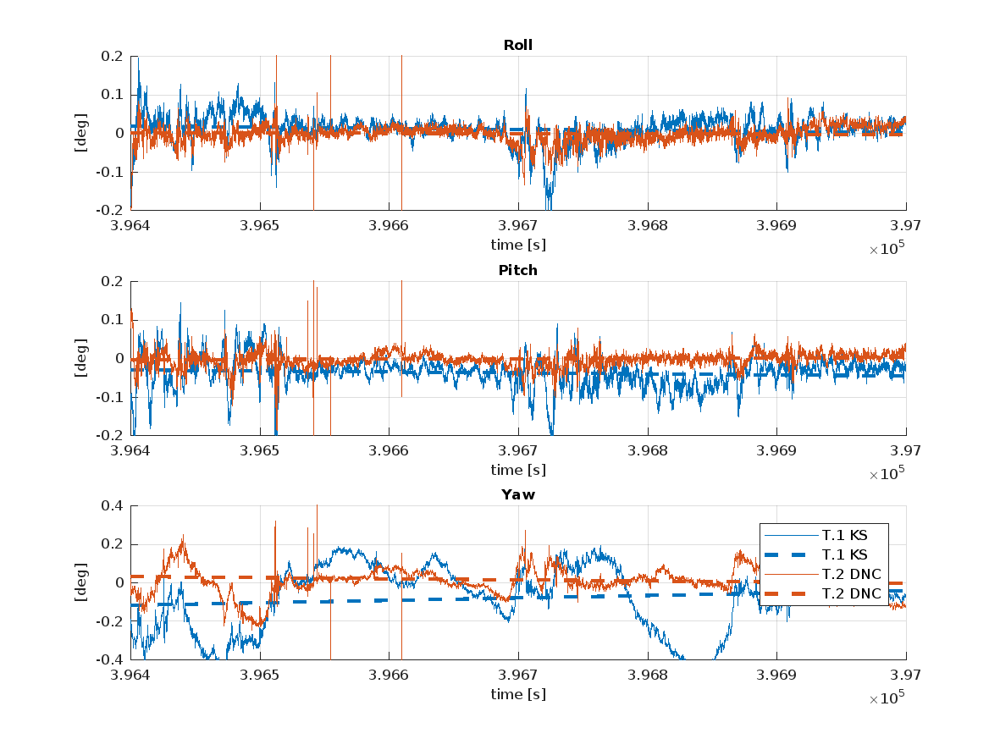
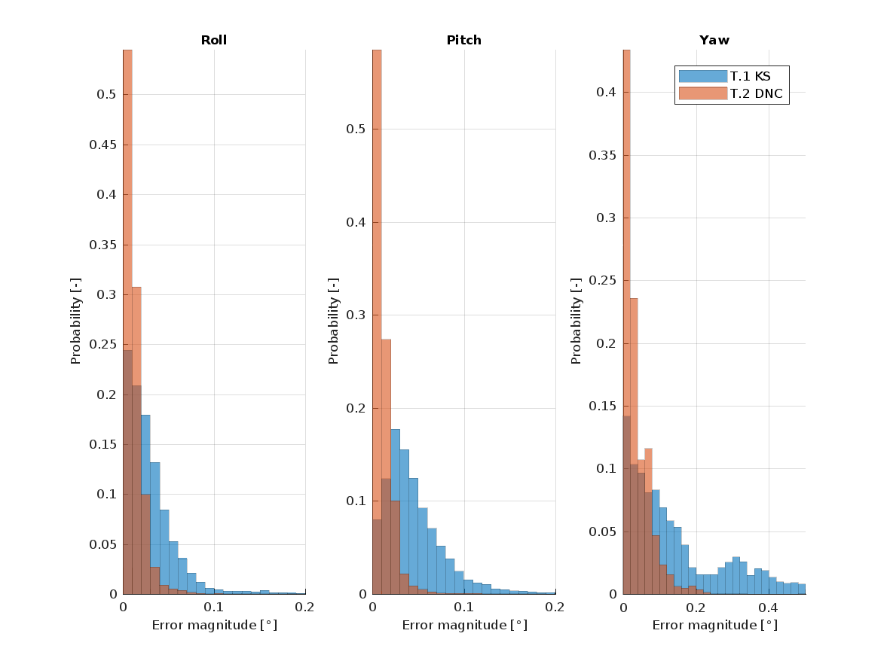

# Lidar Point–to–point Correspondences for Rigorous Registration of Kinematic Scanning in Dynamic Networks

This repository contain an application written in C++ that integrates point-to-point correspondences between LiDAR point clouds with raw inertial and GNSS measurements using Dynamic Networks. The provided code is based on the [ROAMFREE](https://github.com/AIRLab-POLIMI/ROAMFREE) sensor fusion library, which contains the actual solver for Dynamic Network adjustment problems.

The algorithms and methods are presented in detail in the following article:

- Brun, Aurélien, Davide Antonio Cucci, and Jan Skaloud. "LiDAR Point--to--point Correspondences for Rigorous Registration of Kinematic Scanning in Dynamic Networks." *arXiv preprint arXiv:2201.00596* (2022). [(link)](https://arxiv.org/abs/2201.00596)

The code provided in this repository allows to obtain **Trajectory 2 DNC** as presented in *Section 3.3: nominal (optimal GNSS reception)* of the article above. With minor modifications either in the code or in the measurement data, all **DN*** trajectories can be obtained. For example, to obtain the estimated trajectories with simulated GNSS outages, **T.8 DNCo** and **T.9 DNCo1**, it is sufficient to remove records from the GNSS measurement file in the `data` folder. 

## Obtain the code

This repository can be cloned and the submodules initialized with the following commands:

```
git clone https://github.com/TOPO-EPFL/DN-LiDAR.git
git submodule update --init
```

## Build

ROAMFREE relies on Eigen3, and on a modified  version of g<sup>2</sup>o, which in turn relies on suitesparse. Few functions from opencv are also used. A compiler that supports C++11 is required.

On Ubuntu (e.g., 20.04) all required dependencies can be installed with the following command:

```
sudo apt-get install build-essential cmake \
                     libsuitesparse-dev libeigen3-dev libboost-all-dev \
                     libopencv-dev
```

Then, the code can be built from the repository root folder as follows:

```
mkdir build
cd build
cmake .. -DCMAKE_BUILD_TYPE=Release
make
```

## Run

Once the code has been built, an executable named `dn` will be available in the `build` folder. If run, it will provide the following output 


```
$ ./dn 
 * Configuring solver ... 
 * Adding measurements ... 
 * Solving ...  done, final chi2 = 206511.090
 * Compressing results in ../data/trajectories/T2-DNC.tar.gz
 * Removing temporaries
```

An archive named `T2-DNC.tar.gz` is generated in the `data/trajectory` folder of the repository. This archive contains the trajectory referred as **T.2 DNC** in the referenced paper.

## Visualizing the output

A matlab script is provided to compare the estimated trajectory, **T.2 DNC** and the one obtained with Kalman smoothing, **T.1 KS** with the ground-truth one, **T.0 R**,  as presented in *Section 3.3: nominal (optimal GNSS reception)* of the article above.

Running the script `tools/trajectory_comparison/runTrajectoryComparison.m` will produce, among the others, the following two plots depicting the orientation error with respect to the ground truth.





